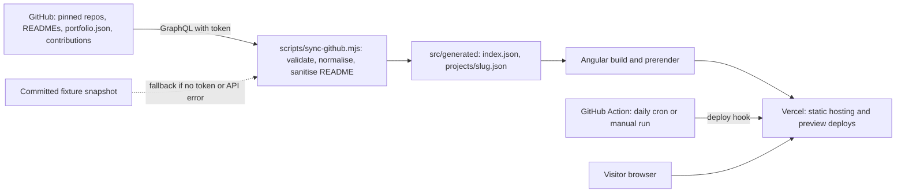
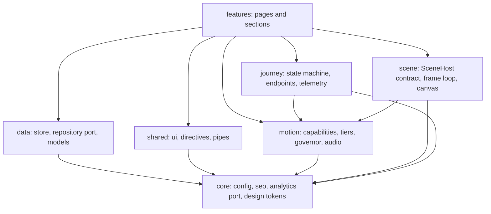
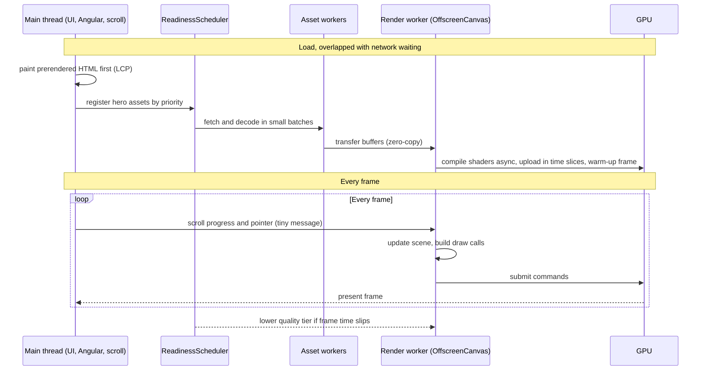
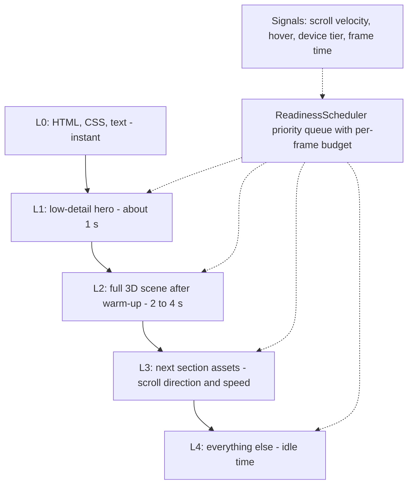

# Portfolio v2 - Architecture

Status: **draft for review** · Branch: `redesign/v2` · Phase 0 (foundation) done, nothing else implemented yet.
What the site does (features, MVP, analytics requirements): see [PRODUCT.md](PRODUCT.md). Visual and interaction rules (tokens, typography, motion, 3D art direction, accessibility): see [DESIGN.md](DESIGN.md).
Creative direction ("Packet's Journey" experience spec, adjustments pending owner confirmation): see [CONCEPT.md](CONCEPT.md). If adopted, it changes the camera driver from scroll to a journey state machine; this document will be updated then.

This is the single architecture document for the rebuild. It covers the system, the frontend layers, the data
pipeline, the motion/3D approach (the "middle ground"), and the performance strategy that makes a 3D site smooth.

Contents: [1 Goals](#1-goals-and-non-goals) · [2 Principles](#2-principles) · [3 System context](#3-system-context) ·
[4 Frontend layers](#4-frontend-layers) · [5 Data architecture](#5-data-architecture) · [6 State and reactivity](#6-state-and-reactivity) ·
[7 Visual and 3D approach](#7-visual-and-3d-approach-the-middle-ground) · [8 Motion system](#8-motion-system) ·
[9 Performance architecture](#9-performance-architecture) · [10 Cross-cutting concerns](#10-cross-cutting-concerns) ·
[11 Quality gates](#11-quality-gates) · [12 Delivery](#12-delivery) · [13 Roadmap](#13-roadmap) ·
[14 Decisions and ADRs](#14-decisions-and-adrs) · [15 How to extend](#15-how-to-extend) · [16 Risks](#16-risks)

---

## 1. Goals and non-goals

**Goals**
- A portfolio that itself demonstrates frontend and full-stack engineering: clean architecture, signals-first reactivity, strong performance, accessibility.
- Projects come from GitHub automatically, so adding a project never means editing HTML.
- A cinematic, fully 3D experience (smooth scroll, parallax, a Three.js hero) that stays smooth on an ordinary integrated-GPU laptop.
- Fast first content, good SEO and link previews, usable without animation or WebGL.

**Non-goals**
- Photoreal / "movie-real" 3D as the default experience (see section 7).
- A backend, a database, or a client-side state library such as NgRx.
- Microfrontends, a monorepo, or other machinery with no problem to solve here.

## 2. Principles

1. **Right-sized.** Every pattern must earn its place. Over-engineering is itself a negative signal.
2. **Budget-first.** Performance budgets are designed first; 3D is added inside them.
3. **Enforced boundaries.** Layer rules are checked by lint, not by good intentions.
4. **Depend on abstractions at the edges.** Data and the 3D scene sit behind interfaces so sources and implementations are swappable.
5. **Progressive enhancement.** Content works without JS animation or WebGL; richer tiers layer on top.
6. **Measure, don't guess.** Evidence is labelled **[measured]**, **[reasoned]** or **[assumed]** throughout.

### 2.1 Adopted principles register

Every principle recommended during design, with its decision and where it lives in this document.

| # | Principle | Decision | Where |
|---|---|---|---|
| 1 | Layered, feature-based structure with enforced dependency rules | Adopted | section 4 (lint rules in Phase 1) |
| 2 | Ports and adapters for data | Adopted | 5.1 |
| 3 | Anti-corruption layer with schema validation | Adopted | 5.2 |
| 4 | Signals-based store behind a facade | Adopted | section 6 |
| 5 | Smart/presentational components, standalone and OnPush | Adopted | section 4 |
| 6 | Motion as an isolated subsystem | Adopted | section 8, S2 to S4 |
| 7 | Performance by design | Adopted | section 9 |
| 8 | Accessibility and progressive enhancement built in | Adopted | section 2, section 10, PRODUCT F11 |
| 9 | Cross-cutting services | Adopted | section 10 |
| 10 | Quality gates and documentation | Adopted | section 11, section 14 (ADRs) |
| 11 | i18n, English and German | **Adopted (structure); German launch pending native review** | 10.2 |
| 12 | Storybook | **Deferred**; internal `/styleguide` route instead | 10.3 |
| 13 | One persistent canvas, with the page's HTML on top | Adopted | S2 |
| 14 | One loop, one scroll source | Adopted | S2 |
| 15 | Keep Angular out of the hot path | Adopted | S3 |
| 16 | Do no work you don't need | Adopted | S10, S12 |
| 17 | Cut draw calls and geometry | Adopted | S8, 7.2 |
| 18 | Kill the first-frame hitches | Adopted | S6 |
| 19 | Adaptive quality and device tiers | Adopted | S9, 7.4 |
| 20 | Progressive loading, so the first paint is never blocked by 3D | Adopted | S6, S7, 9.4 |
| 21 | Compositor-friendly UI | Adopted | S14 |

## 3. System context



- **No runtime GitHub calls.** All GitHub data is fetched at build time and bundled, so there is no rate limit, no loading spinner and no failure if GitHub is down. (The previous site's live calls were capped at 60 requests/hour per IP.)
- **Freshness** comes from rebuilds: pushes, a daily scheduled deploy hook, or a manual run.
- Hosting: **Vercel**. Preview deploys per branch; `main` stays on the old site until cutover.

## 4. Frontend layers



```
src/app/
  core/        SITE_URL, SeoService, AnalyticsPort (+ no-op adapter), ShellService, design/ (tokens.ts, contrast.ts), experience.ts (endpoint and tier ids)
  content/     profile.ts, resume.ts (typed content from the CV)
  data/        models, PortfolioRepository (port), build-time JSON adapter, PortfolioStore (signals), project resolver
  motion/      capability probe, tier ladder, AdaptiveQuality governor, MotionService (reduced motion + effective tier), audio/ (procedural sounds, AudioService)
  scene/       SceneHost contract, FrameLoop (single loop, even pacing), SceneCanvas wrapper, DevOverlay, SceneRegistry, placeholder-scene (replaced by the Three.js host in Spike 0)
  journey/     journey.machine (pure state machine), JourneyService (timers, audio cues, analytics), endpoints, telemetry (simulated)
  features/    home/, work/, resume/, journey/ (page + hud/), styleguide/, not-found/
  shared/      ui/, directives/, pipes/
```

Dependency rules, **enforced by `eslint-plugin-boundaries`** (each rule was verified to fire with deliberate violations):
- `features` may depend on `core`, `data`, `content`, `shared`, `motion`, `scene`, `journey`; nothing depends on `features`.
- `journey` and `scene` may depend on `motion` and `core`; `motion` on `core`; `data` on `core` (and the generated data); `shared` on `core`.
- `core` and `content` depend on nothing else in the app. Root files (`app.ts`, `app.config.ts`, `app.routes.ts`, `main.ts`) are the composition root and are deliberately unrestricted.
- Scene implementations are framework-agnostic: no Angular imports in the frame loop or the hosts. Only `SceneCanvas` and `DevOverlay` are Angular.

Components follow **smart/presentational**: pages fetch and orchestrate; UI components take inputs and emit outputs only.
All components are standalone and `OnPush`; the app is zoneless (Angular 21 default).

Routes: `/` · `/work` · `/work/:slug` (prerendered per project in Phase 4) · `/resume` · `/about` · `/experience` · `/skills` · `/education` · `/not-found` · `**` 404.
Preview routes for the experience engine (Phase 2; not linked, `noindex`): `/journey` and `/styleguide`.
Legacy `/project/:id` URLs redirect to `/work/:slug`. The router uses `withComponentInputBinding()`, `withViewTransitions()` and in-memory scrolling.

### 4.1 The experience engine (Phase 2)

- **State machine** (`journey/journey.machine.ts`): pure TypeScript, no Angular, no timers. `boot -> console -> journey -> room`, with `standard2d` reachable from every state. It is the single driver of the experience (CONCEPT.md section 7). Events that make no sense return the same context object, so it can never reach an invalid state (a 5,000-step random-walk test checks this).
- **JourneyService** runs the machine and owns the side effects: the travel timer (4 s first visit, 2 s repeat, none under reduced motion or on the `static` tier), audio cues and analytics events.
- **SceneHost contract** (`scene/scene-host.ts`): `mount`, `setSnapshot` and `setTier` push coarse state in; `stats()` is pulled a few times a second. The factory is asynchronous so implementations (and Three.js) load lazily. Phase 2 ships a 2D-canvas placeholder behind it.
- **FrameLoop** renders every Nth display refresh, where N is the whole number closest to the tier's fps cap, so frame pacing is even (72 fps on a 144 Hz display with a 60 fps cap, not an uneven mix of 13.9 ms and 20.8 ms frames).
- **Tiers and governor:** `detectTier` picks a starting tier from capabilities; `AdaptiveQuality` steps it down after sustained slow frames and back up only with sustained headroom (hysteresis), never above the detected tier, and never against a tier the user forced.
- **Audio** is synthesised (Web Audio), muted by default, unlocked only by a user gesture, with the mute state held in memory only.

## 5. Data architecture

### 5.1 Ports and adapters
Components never touch JSON or GitHub. They depend on an abstract `PortfolioRepository` (an injection token).

| Adapter | Use |
|---|---|
| `BuildTimeJsonRepository` | Default. Reads the generated JSON bundled at build time. |
| `FixtureRepository` | Tests and offline development. |
| `RuntimeFetchRepository` (future) | Only if instant updates without a rebuild are ever needed. One provider change swaps it in. |

### 5.2 Anti-corruption layer
`scripts/sync-github.mjs` is the only code that knows GitHub's shape. It maps raw GraphQL responses into our own domain
models (`Project`, `Skill`, `ContributionDay`) and validates them with a schema library (Zod or Valibot), so bad data
fails the **build**, not the browser. Domain models are immutable (`readonly`).

### 5.3 What the sync does (build time) — implemented in Phase 1
The sync is TypeScript (`scripts/sync-github.ts` plus `scripts/lib/*`), run by `npm run sync` and automatically by `prestart`, `prebuild` and `postinstall` (`--if-missing`). It shares the domain types with the app.
1. **Fetch.** One GraphQL call (token `PORTFOLIO_GH_TOKEN`): `pinnedItems`, public non-fork repositories, and per repo description, homepage, topics, languages by size, stars, `pushedAt`, `openGraphImageUrl`, `README.md` (three case variants) and `portfolio.json`. The raw response is validated (Zod) so a GitHub API change fails the build clearly. *The contributions calendar is deferred (not needed for the 2D MVP).*
2. **Render.** README to **sanitised HTML at build time** (unified/remark/rehype with `rehype-raw`, `rehype-sanitize`, `rehype-slug`, Shiki). Relative image and link URLs become absolute; headings are demoted one level (the page owns the single H1) and a leading H1 that repeats the title is dropped; a table of contents is generated; external links get `rel="noopener noreferrer"`. Nothing heavy ships to the client.
3. **Normalise and validate.** GitHub shape to domain models; the output is validated strictly (`PortfolioIndexSchema`, `ProjectDetailSchema`), tied to the types by compile-time drift checks. A broken per-repo `portfolio.json` is fail-soft: warned about and ignored.
4. **Write** `src/generated/` (gitignored): `index.json` (card data), `projects/<slug>.json` (README HTML), `project-loaders.ts` (one lazy `import()` per project, so each README is its own chunk and prerender-safe) and `routes.txt` (prerender list for Phase 4).
5. **Failure policy.** No token: use the committed real-data fixture (`scripts/fixtures/github.fixture.json`, recorded with `npm run sync:record-fixture`), **but fail Vercel production builds** so sample data can never ship. Token present and the API fails: **fail in CI**, fall back to the fixture locally with a warning. The app footer shows a notice whenever the source is the fixture.

### 5.4 Opt-in rule
- **Featured** = repos pinned on the GitHub profile (max 6, public only). **As of 2026-10-01 no repositories are pinned**, so the sync falls back to a documented list in `scripts/sync-github.ts` (`FEATURED_FALLBACK`: SynthGraph, ParkRabbit, Eber-app) and says so in its output. Pinning any repo makes the fallback stop applying.
- Optional `portfolio.json` in a repo enriches it: `title`, `summary`, `role`, `stack[]`, `highlights[]`, `cover`, `liveUrl`, `order`, `readme: "full" | "hide"`.
- Fallbacks: GitHub description (boilerplate such as template READMEs is ignored) -> summary; **for featured projects only**, the first real README paragraph; GitHub languages -> stack; GitHub OG image (only if the repo has a custom one) -> cover; `homepageUrl` -> live link. Archive entries show a description or nothing, never README boilerplate. A `hidden: true` manifest field removes a repo from the site.
- All other non-fork repos appear in the "All projects" archive. The profile repo (`Abinash-Anand`) and `.github` are always excluded.
- Note: most current repos have no description or topics, so a `portfolio.json` or a GitHub description is recommended for featured ones (ParkRabbit's README is long and unstructured; several archive repos are course or template projects you may want to hide).

## 6. State and reactivity

- **Signals-first.** One store per feature behind a facade: private writable signals, public read-only `computed`s. No manual `subscribe`.
- **Async data uses stable APIs.** `resource()` / `rxResource` are still `@experimental` in Angular 21 (verified in the type definitions), so they are not used. The store is loaded once by `provideAppInitializer` (every page then reads it synchronously), and per-project README data is loaded by a route **resolver** (`projectPageResolver`) that binds to the page as an input. Revisit when `resource` stabilises.
- **RxJS only for event streams** (scroll, pointer, resize).
- Unidirectional data flow; derived state via `computed`/`linkedSignal`.
- Per-frame values (camera position, pointer) never go through signals bound to templates; see S3.

## 7. Visual and 3D approach (the middle ground)

**Decision:** stylised-realistic. Premium and tangible, but realism is mostly pre-computed or faked, not simulated per frame.
Fully photoreal is out of scope for v1; fully abstract is not the target either. Reason: realistic real-time lighting and
big textures are GPU-bound on integrated graphics and threads cannot fix that **[measured]** (section 9.2).

### 7.1 Recipe
- **A procedural world** around a few hero objects: instanced nodes, lines, particles, custom shaders.
- **Hero concept:** an *event-driven network* (nodes labelled by the stack: Angular, Nest, RabbitMQ, Docker...; edges; glowing message pulses), reacting to pointer and scroll, with the camera dollying through the scroll path. A nod to the event-driven projects.
- **1 to 2 detailed hero objects**, either generated in code (bevelled devices, terminals, racks) or small compressed models.
- **Baked lighting and ambient occlusion**; soft contact shadows baked into textures. **No real-time shadows.**
- **Matcap / env-mapped materials** for gloss and metal. **No transmission/glass** (very costly); fake it with Fresnel rim glow.
- **Tiny environment map** (about 100 KB) instead of large HDRs.
- **Restrained post-processing:** at most one cheap pass (grain or vignette) on the high tier, none below.

### 7.2 Asset limits (starting values)
| Item | Limit |
|---|---|
| Each hero model (compressed) | <= about 300 KB |
| Textures | 1K to 2K, KTX2 (GPU-compressed) |
| Environment map | <= about 100 KB |
| First-scene total | <= about 1.5 MB |
| Draw calls / triangles | about 100 / about 150k (high), about 50k (low) |

### 7.3 Pipeline
Models are processed at build time (`scripts/optimize-assets.mjs`, glTF-Transform: Draco or Meshopt geometry, KTX2
textures). Spike 0 uses code-generated objects only; modelled or CC0 assets are an option later (open decision).

### 7.4 Fallback ladder
`high` (env map, light post) -> `medium` (baked only) -> `low` (reduced scene) -> `static` (CSS fallback, no WebGL).
The headline and content are real DOM text over the canvas, so they stay indexable, selectable and accessible; the canvas is `aria-hidden`.

## 8. Motion system

- **Lenis** smooth scroll, driven by the GSAP ticker, synced to **ScrollTrigger**. Off under `prefers-reduced-motion`.
- **GSAP + ScrollTrigger** is the single animation engine: pinned sequences, parallax layers, split-text reveals, stacked featured-work scroller, magnetic/tilt interactions.
- **Declarative directives** (`appReveal`, `appParallax`, `appSplitText`, `appTilt`, `appMagnetic`) wrap GSAP inside `afterNextRender`, with `gsap.context()` cleaned up through `DestroyRef`.
- **`MotionService`** exposes `reducedMotion` and `tier` signals; animations read these instead of deciding for themselves.
- **Flash-free SSR:** an inline script in `index.html` adds `html.motion-ok` before first paint. Hidden initial states exist only under that class, so reduced-motion and no-JS visitors always see content. (Done in Phase 0.)
- **View Transitions** morph a project card into its detail page.
- Libraries are loaded by dynamic `import()` and only in the browser.

## 9. Performance architecture

Goal: steady frame delivery on an ordinary integrated-GPU laptop, fast first content, no main-thread blocking the user can feel.

### 9.1 How the browser uses the GPU (reference)
1. Parse, style, layout and paint recording are CPU only. Paint produces a display list, not pixels.
2. The compositor and raster threads turn the display list into tiles (usually drawn on the GPU), then the GPU composites all layers and presents at vsync. This happens for every page, even without 3D.
3. With WebGL, JavaScript talks to the GPU process directly: context creation, buffer and texture upload, shader compile, then per-frame draw calls.
4. The GPU executes asynchronously on thousands of cores; the CPU can run ahead a few frames until backpressure builds.
5. A late frame at vsync is a dropped frame.

Pressure points: upload size, shader compile at first use, draw-call count, GPU shader cost (pixels x complexity), compositing and presenting.
Frame time is roughly **max(CPU time, GPU time)**, not the sum, as long as the two overlap.

### 9.2 Evidence: what we measured
A throwaway benchmark (not part of the site) rendered a tunable full-screen WebGL shader on the main thread and in a
Web Worker (`OffscreenCanvas`), with and without a synthetic main-thread stall (45 ms of work every 100 ms).

| Scenario | 3D on main thread | 3D in worker |
|---|---|---|
| Light scene, idle page | 144 fps, 0 dropped | 143 fps, 0 dropped |
| Light scene, main thread busy | 101 fps, 29 dropped, worst frame 41.8 ms | 144 fps, 0 dropped, worst frame 7.4 ms |
| GPU-bound scene (about 33 ms/frame), idle | 30 fps | 31 fps |
| GPU-bound scene, main thread busy | 30 fps | 31 fps |

Conclusions **[measured]**: (1) a render worker removes main-thread contention from the 3D; (2) it does nothing for a
GPU-bound scene, which needs a smaller workload; (3) the main thread still stutters when busy, so scroll-linked UI work
must stay small regardless.
Limits: one machine (integrated AMD Radeon via ANGLE/D3D11, 12 logical cores, 144 Hz), 1024x576 canvas, 3-second runs,
single run each, synthetic shader and stall. Not tested: real Three.js scene, phones, Safari, worker-side asset loading,
input-message latency. Everything else below is **[reasoned]** until Spike 0.

### 9.3 Strategies

| # | Strategy | How it lands here | Evidence |
|---|---|---|---|
| S1 | Budget-first, enforced in CI | Angular budgets, Lighthouse CI, size check for the 3D chunk and asset folder | reasoned |
| S2 | One canvas, one loop, one scroll source | Persistent canvas behind the DOM; Lenis -> GSAP ticker -> ScrollTrigger -> render; scroll drives the camera path | reasoned |
| S3 | Angular out of the hot path | `SceneHost` is an imperative class; thin Angular wrapper; signals only on coarse events | reasoned |
| S4 | Render worker as an opt-in tier | `MainThreadSceneHost` and `WorkerSceneHost` behind one interface; always keep the main-thread fallback; own message-driven camera control (no `OrbitControls` in a worker) | benefit **measured** for CPU stalls only; Safari and message latency assumed |
| S5 | Asset decoding in worker pools (always) | `createImageBitmap`, Draco/Meshopt, KTX2 transcoding off-thread; transfer buffers zero-copy | reasoned |
| S6 | Early preparation during load | `preload`/`modulepreload`, early GL context, `compileAsync`, `initTexture` in time slices, hidden warm-up frame, immutable caching | reasoned |
| S7 | ReadinessScheduler | Priority queue with a per-frame budget (about 4 ms) and intent signals (see 9.4) | reasoned |
| S8 | CPU/GPU balance rules | Profile first. GPU-bound: hoist work, CPU culling/LOD, baking, fewer pixels. CPU-bound: instancing, merged geometry, GPU-side animation and particles. Avoid sync points | reasoned |
| S9 | Device tiers and adaptive quality | Detect GPU class; watch frame time; degrade in steps with hysteresis (pixel ratio, effects, particles, static) | reasoned |
| S10 | Frame pacing and render-on-demand | Cap to a rate we can hold (e.g. 60 on a 144 Hz display); pause when hidden or off-screen; skip unchanged frames; prepare once then idle | reasoned |
| S11 | Graceful fast-scroll degradation | Low-detail placeholder, upgrade in place, never block | reasoned |
| S12 | Memory discipline | Per-tier texture budget, KTX2, dispose on route change, no allocations in the frame loop | reasoned |
| S13 | Observability | Dev overlay (fps, frame ms, draw calls, triangles, texture memory, tier), real-user Web Vitals, Lighthouse CI | reasoned |
| S14 | Compositor-friendly DOM | Animate only `transform`/`opacity`, `content-visibility: auto`, batched reads/writes, passive listeners | reasoned |

Why S6 and S7 together: while the network is busy the CPU and GPU are idle, users read before they scroll, and scroll
direction and speed are predictable. Shaders cannot ship precompiled (they compile on the visitor's driver), so we can
only move that cost earlier, not remove it. Fast scrolling is normal for skimming (recruiters skim), so it must never block.

### 9.4 Diagrams





Every scheduled task has a deadline and a fallback, because idle time is not guaranteed (slow devices, background tabs,
`requestIdleCallback` starvation).

### 9.5 Starting budgets (to calibrate in Spike 0)

| Metric | Target |
|---|---|
| Initial JS before 3D | <= about 100 KB gzipped (Phase 0 shell: about 66 KB transferred) |
| Lazy 3D code chunk | <= about 200 KB gzipped |
| First-scene assets | <= about 1.5 MB |
| LCP / INP / CLS | < 2.5 s / < 200 ms / < 0.1 |
| Frame rate | 60 fps on a mid-range laptop, >= 30 fps on low tier |
| GPU time per frame, baseline device | about 10 ms (headroom for thermal throttling) |
| Lighthouse mobile performance | >= 90 |

### 9.6 Considered and deferred or rejected

| Idea | Decision | Why |
|---|---|---|
| Photoreal / movie-real as default | Rejected for v1 | GPU-bound on integrated graphics; threads cannot fix it [measured]. Revisit only after Spike 0. |
| WebGPU compute, indirect draws, render bundles | Deferred | Strong CPU/GPU balancing, but support and complexity cost. |
| WebAssembly SIMD for CPU math | Deferred | Only if CPU-side math becomes the measured bottleneck. |
| Multiple render workers | Rejected | One GL context lives on one thread; the GPU stage does not parallelise this way [measured]. |
| Multiple canvases | Rejected | Duplicate contexts and GPU memory (S2). |

### 9.7 Spike 0: prove it before building everything
One real hero scene following section 7 (procedural world plus code-generated hero objects), with the dev overlay and budgets in place.
Run on the baseline integrated-GPU laptop and a mid-range phone. Success criteria:
- holds the target frame time while idle and while scrolling on the baseline device;
- the worker tier, if enabled, shows no regression versus main-thread and the fallback path works;
- first content (LCP) is not delayed by early preparation;
- the tier ladder degrades smoothly when frame time is pushed over budget;
- memory stays inside the per-tier budget across route changes.

## 10. Cross-cutting concerns

- **Errors:** a global `ErrorHandler` with graceful degradation (a failed 3D load falls back to the static tier, never a blank page).
- **Logging:** a `Logger` abstraction replaces `console.log`; no-op in production builds.
- **SEO:** `SeoService` sets title, meta and Open Graph per page (GitHub OG image for projects), JSON-LD `Person`, sitemap and robots at build.
- **Config:** typed injection tokens (no scattered constants).
- **Accessibility:** semantic landmarks, skip link (done), keyboard-operable interactive elements, visible focus, `prefers-reduced-motion`, real DOM text over the canvas; template a11y lint rules are enabled.
- **Security and privacy:** build-time sanitised README HTML only (`safe-html` pipe is the one place that trusts it); no secrets in the client; fonts self-hosted (done), no third-party trackers; CSP and security headers set via Vercel; dependency audit in CI.
- **Germany:** the site probably needs an Impressum and privacy page. Treat as a requirement to verify (not legal advice).
- **i18n (English and German):** adopted for v1; see 10.2.

### 10.1 Analytics and privacy (consent-free by design)

Goal: know how the site is used without collecting anything that needs consent. Requirements live in PRODUCT.md section 3.

**Rules (non-negotiable):**
- no cookies, no `localStorage`/`sessionStorage`/IndexedDB identifiers, no fingerprinting, no raw IP storage, no cross-site tracking;
- aggregated data only; no personal data in events or URLs;
- Do Not Track and Global Privacy Control turn analytics off;
- EU-hosted processor with a data-processing agreement (or self-hosted), documented retention;
- the privacy page states exactly what is collected. Whether consent is required should be verified (not legal advice); cookieless, aggregated, device-storage-free analytics generally avoids it.

**Collected (anonymous):** page views and approximate unique visitors (the provider's daily-rotating hash, so there is **no returning-visitor tracking across days**), referrer and campaign parameters, country/city derived from the IP then discarded, device class, browser, OS, screen size, plus the events below.

**Not collected:** names or emails, raw GPU/CPU/memory details (fingerprinting vectors; only the coarse tier), company lookups from the IP.

| Event | Properties |
|---|---|
| `cv_download` | none |
| `project_open` | `slug` |
| `contact_click` | `channel`: email, github, linkedin, instagram |
| `scroll_depth` | `percent`: 25, 50, 75, 100 |
| `web_vitals` | `metric` (LCP, INP, CLS), bucketed value |
| `tier` | `high`, `medium`, `low`, `static` |

Time on page comes from the provider's engaged-time measure.

**Tracked links:** `?utm_source=application&utm_campaign=<company>`, per company and never per person (a per-person label would be personal data).

**Implementation:**
- `AnalyticsPort` in `core/` with a single `track(event)`; the event type is a typed union, so only allowed events and properties compile.
- Adapters: `PlausibleAdapter` or `UmamiAdapter` (one real provider), and `NoopAdapter` for development, tests and DNT/GPC.
- Declarative tracking with an `appTrack` directive on links and buttons; page views from router events; scroll depth from IntersectionObserver sentinels (not scroll events); `web-vitals` loaded lazily on idle after load, so analytics never sits in the LCP path.
- Known limit: ad blockers undercount, so numbers are approximate.

**Provider (pending decision):** Plausible (EU-hosted, paid, handles most of the list natively), Umami (open source, free cloud tier or self-hosted), or Vercel Web Analytics and Speed Insights (simplest on Vercel; check plan limits for custom events).

### 10.2 Internationalisation (English and German)

Decision: the i18n structure is adopted. English is the default locale and German the second.

**Revised after the Master CV (2026-10-01):** the CV states German A2, progressing toward B1. The owner therefore cannot be the final reviewer of German copy, and a fully German site could imply a higher proficiency than the CV states. Recommendation: build the i18n structure from Phase 1, but ship German content at launch **only after review by a native speaker**; otherwise launch English-only and add German later. Decision pending with the owner.

- **Approach:** Angular's built-in build-time i18n (`@angular/localize`). Every UI string is marked with `i18n`, `ng extract-i18n` produces the translation files, and the build emits one static site per locale. Chosen over a runtime library (for example Transloco) because it has no runtime cost, prerenders cleanly per locale and is better for SEO. **[reasoned; verify the multi-locale prerender build early in Phase 1]**
- **URLs:** `/` is English and `/de/` is German. `SeoService` sets `<html lang>`, `hreflang` alternates and canonical URLs per locale. There is a visible language switcher and **no automatic redirect by browser language or location** (it surprises users, and it avoids using location data).
- **Translated:** UI strings and `content/profile.ts`; dates and numbers follow the locale.
- **Not translated:** GitHub-sourced text (READMEs, repo descriptions) stays in its source language. Optional per-locale fields in `portfolio.json` (for example `summary_de`) can be added later.
- **Costs:** build and prerender time multiply by the number of locales, and switching language is a full navigation (the 3D scene reloads).
- **Process:** strings are marked from Phase 1 so nothing is retrofitted; German copy is drafted by the assistant and must be **reviewed by a native speaker** before it ships; CI fails on missing translations.

### 10.3 Styleguide instead of Storybook (MVP)

- **Decision:** Storybook is deferred. For the MVP, an internal `/styleguide` route in the same app renders the design tokens, the shared UI primitives and the motion-directive demos. It is excluded from the sitemap and marked `noindex`.
- **Why:** it shows the design system at a fraction of the cost: no second toolchain, build or hosting, and it runs against the real app configuration. Storybook is a good fit for a larger component library, but it is heavy for one site.
- **Revisit** if the shared UI grows large or if presenting the design system becomes a goal in itself. Storybook can be added later without changing components.

## 11. Quality gates

- **Static:** strict TypeScript and strict templates (on), `angular-eslint` with template a11y rules (done), boundary rules (Phase 1), Prettier.
- **Tests:** unit tests for pure logic (sync normalisation, manifest validation, store selectors, scheduler, tier selection); component tests for presentational UI; Playwright smoke tests with axe for accessibility. Done so far: shell and legacy-redirect specs (6 tests).
- **CI (GitHub Actions) blocks merges on:** lint, tests, build, bundle budgets, Lighthouse CI, `npm audit` for production dependencies.
- **Conventions:** conventional commits; automated dependency updates; ADRs for decisions (section 14).

## 12. Delivery

- **Vercel** builds on push and gives preview URLs per branch. The build runs the sync (`prebuild`), with `PORTFOLIO_GH_TOKEN` set in Vercel (Production and Preview).
- **Scheduled freshness:** a GitHub Action (daily cron plus a manual button) calls a Vercel **deploy hook** (`VERCEL_DEPLOY_HOOK` secret).
- **Prerender:** `@angular/ssr` static output; per-project routes via `getPrerenderParams`. `vercel.json` (added in Phase 1) provides the single-page-app fallback rewrite and immutable caching for hashed `js`/`css`/`woff2` files; it is revisited with prerendering in Phase 4.
- **Steps only the owner can do** (tokens are never handled by the assistant): create the GitHub token (public data only), add it to Vercel, create the deploy hook and add it as a GitHub secret, pin the repos to feature.

## 13. Roadmap

This is the **authoritative phase plan**. It supersedes the earlier scroll-driven roadmap, which predates the "Packet's Journey"
concept. CONCEPT.md section 8 is the scene-level view and maps onto these phases. Each phase ends in a deployable Vercel preview
and a **review stop**.

| Phase | Scope | Exit criteria | Status |
|---|---|---|---|
| 0. Foundation | Branch, dependency patches (0 audit findings), angular-eslint, skeleton routes and shell, design tokens, self-hosted fonts, favicon, legacy redirects, motion gate | Lint, tests and build green | **done** (uncommitted) |
| 1. Content and data foundation (safety net first) | GitHub sync script **in TypeScript** with fixture and schema validation; `PortfolioRepository` port and adapters; `PortfolioStore`; typed content files from the CV (profile, experience, education, skills); `/work` and `/work/:slug`; **2D resume `/resume`** with print styles and CV download; a 2D page per endpoint (`/about`, `/education`, `/skills`, `/projects`, `/experience`); `SeoService` basics; boundary lint; i18n structure; `AnalyticsPort` with the no-op adapter; CI (lint, tests, build, budgets) and the deploy-hook Action | A complete, accessible, indexable 2D site on a Vercel preview with real GitHub data and no WebGL. **Shippable on its own** | **done** (uncommitted). Deferred from the plan: contributions calendar (not needed for the 2D MVP), `de` locale build (German pending native review; `ng extract-i18n` works and 54 messages are extracted), real analytics provider (Phase 4) |
| 2. Design system and experience engine (no heavy 3D) | HUD components; journey state machine (pure TypeScript, unit-tested); audio service (Web Audio); `MotionService` and tier detection; `SceneHost` interface with the main-thread host; dev overlay (FPS, draw calls, memory); `/styleguide`; owner sign-off of the visual mock (DESIGN.md section 17) | HUD and state machine run over a placeholder scene; design decisions signed off | **done** (uncommitted). Built: journey state machine, `/journey` HUD flow over a placeholder scene, procedural audio, tiers and governor, dev overlay, `/styleguide`. Pending: owner sign-off of DESIGN.md section 17 and CONCEPT.md A1 to A8 |
| 2.5 Spike 0 (measured) | Boot scene (procedural headset, console), tunnel, About room (server vault, database vault, dashboard), measured on the baseline laptop and a phone; decide the worker tier; calibrate budgets | Section 9.7 criteria met, or scope and fidelity reduced **before** Phase 3 (go/no-go) | next |
| 3. Rooms and integration | Remaining rooms (Skills, Projects from data, Education, Experience); `ReadinessScheduler`; tiers and adaptive quality; skip and repeat journeys; URL and back-button wiring to the state machine; worker tier if approved; analytics events | Every endpoint works in 3D and 2D with parity; budgets hold on the baseline devices | |
| 4. Production hardening | SSR static prerender and Vercel rewrites; SEO, Open Graph, sitemap, JSON-LD; accessibility audit (axe, keyboard, screen reader); Lighthouse CI budgets enforced; real-user Web Vitals; security headers and CSP; privacy page (and Impressum if required); analytics provider wiring; German and `hreflang` only if natively reviewed; caching headers | Lighthouse mobile >= 90, axe clean, all checklists in CONCEPT.md section 9 and DESIGN.md section 16 pass | |
| 5. Launch | Merge `redesign/v2` to `main`; production deploy on the existing Vercel project and domain; swap in the new CV; verify redirects; monitoring | Live and verified | |
| 6. Post-launch (optional) | Integrations (writing via RSS, npm, WakaTime, activity graph); Storybook revisit; photoreal top tier revisit | | |

Dependencies and cut lines:
- Phase 1 is shippable by itself, so a complete site exists before any 3D work starts.
- Phase 2.5 is a go/no-go gate: if the About journey cannot hold the frame budget on an integrated GPU, we reduce fidelity or scope before building the remaining rooms.
- Phases 3 to 4 never remove the 2D path; the 2D resume is the fallback tier (`static`).

## 14. Decisions and ADRs

**Decided**
| Decision | Notes |
|---|---|
| Build-time GitHub sync, no runtime calls, no backend | |
| Hosting on Vercel | |
| Three.js WebGL hero with CSS fallback | |
| Fresh visual redesign | Direction confirmed at the Phase 2 mock |
| Featured projects = pinned repos, optional `portfolio.json` | |
| **Middle-ground visual approach** (stylised-realistic) | Decided 2026-10-01 |
| Movie-real top tier out of scope for v1 | Inferred from "settle in the middle"; revisit after Spike 0 |
| Privacy-first, consent-free analytics (cookieless, aggregated, no device storage) | Decided 2026-10-01; provider still pending; see 10.1 |
| All ten recommended core principles | Adopted; see the register in 2.1 |
| i18n: English default, German second, Angular build-time localisation | Structure adopted; German launch pending native review (owner is A2 per CV); see 10.2 |
| Storybook deferred; internal `/styleguide` route instead | Recommendation, can be overruled; see 10.3 |

**Pending**
| Decision | Recommendation |
|---|---|
| Baseline device (laptop only, or also a mid-range Android phone) | Include a phone in Spike 0 |
| Render worker in v1, or after the spike | After the spike, behind the `SceneHost` interface from day one |
| Asset sourcing for hero models (code-only, CC0, modelled) | Code-only for Spike 0; models optional later |
| Analytics provider (Plausible, Umami or Vercel Analytics) | Plausible or Umami; the `AnalyticsPort` keeps the choice swappable |
| Error monitoring, feature flags | Default: none beyond the Logger; a debug override for the tier |

**Proposed ADRs** (each a short file in `docs/adr/`)
- ADR-001 Budget-first performance, enforced in CI
- ADR-002 Build-time GitHub sync with ports and adapters
- ADR-003 Signals-first state; no NgRx
- ADR-004 Single persistent canvas, single render loop, single scroll source
- ADR-005 Imperative scene island behind a typed interface
- ADR-006 Render worker as an opt-in tier with a main-thread fallback
- ADR-007 ReadinessScheduler with per-frame budgets and intent signals
- ADR-008 Middle-ground visual approach; procedural-first assets
- ADR-009 Device tiers and adaptive quality with hysteresis
- ADR-010 Defer WebGPU and WebAssembly SIMD
- ADR-011 Consent-free analytics behind an `AnalyticsPort`
- ADR-012 Build-time i18n (English and German) with Angular localisation
- ADR-013 Internal `/styleguide` route instead of Storybook for the MVP
- ADR-014 Stable async APIs (app initializer plus route resolvers) instead of experimental `resource()`
- ADR-015 Sync failure policy: real-data fixture locally, fail in CI and on production without a token
- ADR-016 Pure journey state machine as the single driver of the experience (replaces scroll)
- ADR-017 Asynchronous SceneHost factory, so scene implementations and Three.js are lazy-loaded
- ADR-018 Frame pacing by whole display refreshes instead of time-based frame skipping

## 15. How to extend

- **Add a project:** pin the repo on GitHub (optionally add `portfolio.json`). It appears after the next scheduled or manual deploy. No code change.
- **Add a section to the home page:** create a presentational component under `features/home/sections/`, read data from the store, wrap below-the-fold sections in `@defer`, use the shared directives for motion.
- **Add an integration (e.g. articles, npm stats):** add a provider under `scripts/providers/` (fail-soft, merged into the same generated JSON), extend the models and schema, add a store selector and a section. LinkedIn has no public read API and stays a link.
- **Change the data source:** provide a different `PortfolioRepository` adapter; components do not change.

## 16. Risks

- **GPU cost on integrated graphics** is the central unknown; Spike 0 exists to retire it.
- **SSR plus animation:** initial hidden states must stay gated by `html.motion-ok` to avoid flashes or hydration mismatches.
- **Worker rendering support** (Safari) and message latency are unverified; the main-thread fallback is mandatory.
- **README quality:** unstructured READMEs render roughly; use `portfolio.json` for featured projects. The hand-written ParkRabbit and Eber case-study cards are dropped until manifests exist.
- **Pinned repos** are capped at 6 and exclude private repos.
- **Over-engineering:** the principle in section 2 applies to this document too; cut anything that cannot be tied to a measured or clearly reasoned need.
