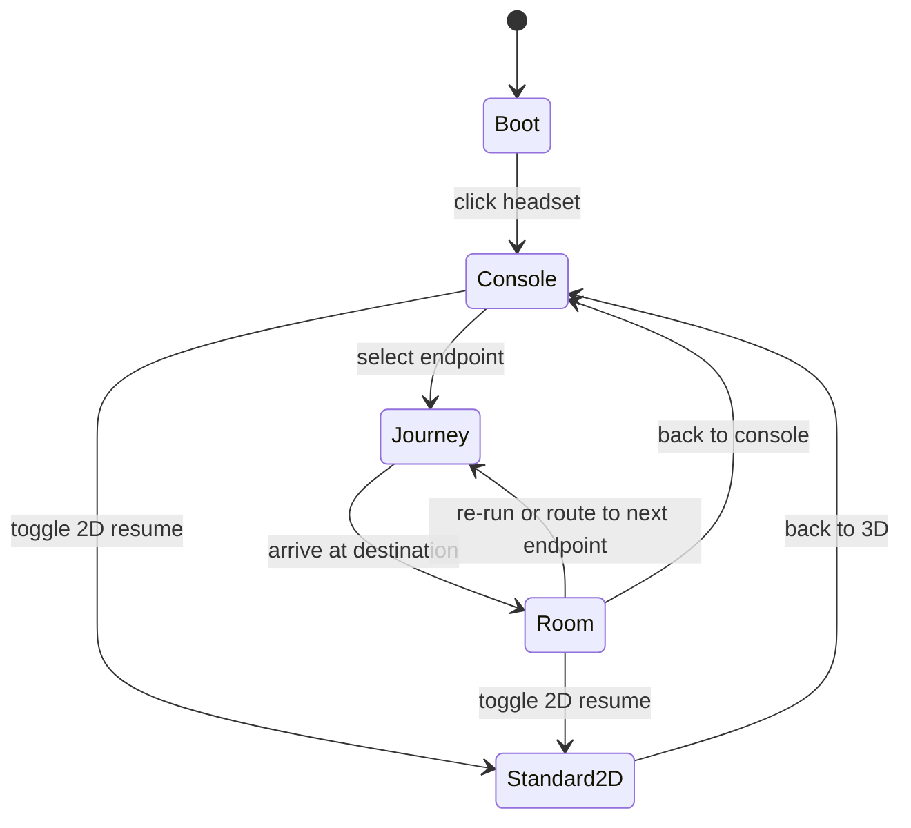

# Packet's Journey - Creative concept and experience spec

Status: **concept captured, adjustments pending owner confirmation** · Owner: Abinash Anand · Captured: 2026-10-01
Related: [ARCHITECTURE.md](ARCHITECTURE.md) (how it is built) · [PRODUCT.md](PRODUCT.md) (what ships, MVP) · [DESIGN.md](DESIGN.md) (visual and interaction rules)

## How to use this document

- **Sections 1 to 5 are the owner's concept and the source of truth.** Text strings, labels, colours and sequences are quoted from it. Do not change them without the owner.
- **Section 6 lists proposed adjustments.** They are *not* decided until the owner confirms them; each has a status.
- **Sections 7 to 10 translate the concept into implementation.** Review them at the start of each phase and before merging any scene.
- Re-read section 9 (acceptance checklists) whenever a scene, room or HUD element is built or changed.

## 1. Pitch and aesthetic

**Packet's Journey: the Full-Stack VR Portfolio Experience.** The visitor *is* a network packet. They send an HTTP request
from a VR headset, travel down a fibre-optic channel into a NestJS server vault and a database vault, and return with a
`200 OK` response that renders the content. The journey through the stack is the portfolio's argument.

- **Theme:** Digital Substratum, Dark Network Earth.
- **Aesthetic:** high-precision architectural, dark minimalist ("Stuttgart Node"). No standard web pages, no scrollbars, no traditional navbar.
- **Void colour:** `#0A0D12`. **Tech Blue:** `#3B82F6` (circuit traces, HUD gridlines, hands).
- **Terminal text:** emerald green (exact hex TBD).
- **Particles:** cyan and gold `0`s and `1`s. **Backend vault lights:** deep indigo and violet. **Query beam:** yellow. **Response container:** golden.
- **Audio:** low-frequency hum, mechanical click, lens-lock, pneumatic click, WHOOSH.

## 2. Experience flow



The 2D resume toggle is available from every state (see section 5).

## 3. Prologue and Acts I to V (the About journey)

### Prologue: boot sequence and neural interface
- Engineered dark void (`#0A0D12`). A soft low-frequency hum plays.
- Centre of the screen: a sleek, matte-black **cybernetic VR headset** floating weightless. Thin Tech Blue circuit traces outline its visor.
- Above it, a blinking retro terminal prompt in emerald green:

```
SYSTEM STATUS: ONLINE
TARGET NODE: STUTTGART_COMPUTE_CORE // HOST: ABINASH_ANAND
ACTION REQUIRED: INITIALIZE NEURAL LINK TO ENTER DIGITAL SUBSTRATUM
```

- **Hover** the headset: circuit traces glow with an intense low-opacity aura, with a subtle mechanical click.
- **Click:** the headset flies forward and fills the field of view; the camera snaps shut with the sound of an optical lens locking.

### Act I: the client terminal and browser layer
- The lens clears. First-person view inside a dark, polished glass chamber (the Client Browser Environment on top of the Digital Substratum).
- Lower corners: cybernetic HUD hands outlined in faint blue gridlines.
- HUD overlay:
  - Top left: `IP: 127.0.0.1 | LOCATION: STUTTGART, GERMANY`
  - Top right: `FPS: 60 | LATENCY: 0ms | ENGINE: REACT THREE FIBER` (see adjustment A4)
  - Bottom right: `[ MUTE AUDIO ]` | `[ HIGH GRAPHICS ]`
- A curved holographic **Control Console** with five glowing 3D keycaps, each an endpoint of the system architecture:

| # | Keycap | Meaning |
|---|---|---|
| 1 | `[ GET /api/v1/about ]` | Origin and Core Identity |
| 2 | `[ GET /api/v1/education ]` | HFT Stuttgart Compute Core |
| 3 | `[ GET /api/v1/skills ]` | Microservice Pipeline |
| 4 | `[ GET /api/v1/projects ]` | Deployed Systems (SynthGraph and ParkRabbit) |
| 5 | `[ GET /api/v1/experience ]` | Git Commit Telemetry |

- HUD prompt: "Select a payload endpoint to execute request."

### Act II: the quantum serialization (speed of light)
- The visitor presses `[ GET /api/v1/about ]` with their cybernetic hand.
- **Trigger:** a heavy pneumatic click; the glass floor shifts to reveal the deep wireframe network beneath.
- **Drop:** the platform opens and the camera drops into a massive vertical conduit. The avatar deconstructs into glowing cyan and gold `0`s and `1`s (custom particle shader).
- The camera shoots through an infinite fibre-optic data channel; binary code, packet headers and network lines streak past in hyper-speed motion blur.
- **Live telemetry overlay**, top centre of the HUD:

```
>>> OUTBOUND REQUEST INITIALIZED
>>> PROTOCOL: HTTPS/2 | TLS 1.3
>>> METHOD: GET
>>> TARGET: api.abinash.dev/v1/about
>>> RTT TIMER: 2ms... 8ms... 14ms...
```

- The camera arcs through a curved glass channel toward a massive blue-and-violet illuminated node.

### Act III: the NestJS / Node.js compute engine
- At 18 ms the conduit enters a cavernous, cathedral-like server vault glowing deep indigo and violet: the NestJS backend inside the Digital Substratum Dark Network. 50-foot server racks, pulsing LEDs, quietly humming cooling fans.
- The camera slows, floating down the central aisle as the packet reaches the gateway:
  1. **Gradients and guards:** floating laser gates labelled `AuthGuard` and `ValidationPipe` scan the packet and flash emerald green (`STATUS: AUTHORIZED`).
  2. **The controller node:** a central spinning server core inside a glass cylinder, branded with a glowing NestJS and Node.js emblem.
  3. **The skill environment:** floating architectural text panels light up:
     - "Engineered with TypeScript & NestJS for strict domain boundaries and modular architecture."
     - "Asynchronous non-blocking I/O processing active."
- The core executes `AboutService.getProfile()`. A secondary yellow beam shoots into a subterranean side-channel labelled `POSTGRESQL_PRIMARY_CLUSTER`.

### Act IV: the database query and payload assembly
- The camera follows the yellow beam down into the underground Data Persistence Vault: metallic database drums (PostgreSQL and MongoDB) in a precise circular array.
- A laser arm scans the target drum. Holographic records materialise in mid-air:

```
NAME: Abinash Anand
ROLE: Full-Stack Software Engineer
LOCATION: Stuttgart, Germany
STATUS: Enrolled in M.Sc. Software Technology @ HFT Stuttgart
SPECIALIZATION: Software Architecture, Distributed Systems & Agentic Workflows
```

- The laser packs the records into a glowing golden briefcase-like container marked `RESPONSE_BODY (200 OK)`.

### Act V: the 200 OK response stream and data rendering
- The server core locks the response container onto the user's particle stream. HUD timer: `STATUS 200 OK | PAYLOAD SIZE: 2.4KB | TIME: 24ms`.
- With a sharp WHOOSH, the particle stream fires back up the fibre-optic channel to the surface.
- The camera shoots out of the floor of the Client Terminal and lands softly in first-person stance. The golden container floats up, opens, and projects a glassmorphic dashboard in front of the user's hands:

```
┌────────────────────────────────────────────────────────────────────────┐
│  ABINASH ANAND // FULL-STACK SOFTWARE ENGINEER                         │
├────────────────────────────────────────────────────────────────────────┤
│  M.Sc. Software Technology Student at HFT Stuttgart.                   │
│  Specializing in building end-to-end production software across        │
│  reactive Angular/React frontends and robust Node.js/NestJS backends.  │
│                                                                        │
│  • Location: Stuttgart, Germany                                        │
│  • Core Stack: TypeScript, NestJS, React, Angular, PostgreSQL, Docker │
└────────────────────────────────────────────────────────────────────────┘
```

- The user can now review freely. Two glowing physical buttons at the base: `[ RE-RUN PACKET JOURNEY ]` and `[ ROUTE TO NEXT ENDPOINT: EDUCATION / HFT STUTTGART ]`.

## 4. Section sub-routines (other endpoints)

Selecting another endpoint routes the packet to a distinct sub-node of the Digital Substratum.

1. **`GET /api/v1/education`: the HFT Stuttgart Compute Core.**
   - Destination: a high-security server tower glowing with HFT Stuttgart blue accents (`STUTTGART_NODE_01`).
   - Visualisation: the camera enters the server blade `M.SC_SOFTWARE_TECHNOLOGY`. Terminal windows display coursework, research modules and software-architecture implementations.
2. **`GET /api/v1/skills`: the Microservice Circuit Grid.**
   - Destination: a 3D printed circuit board in dark space.
   - Visualisation: skill domains as hardware microchips:
     - Frontend chip: TypeScript, React, Angular, Next.js, RxJS, with active data streams.
     - Backend chip: Node.js, Express.js, NestJS, REST, GraphQL, WebSockets.
     - Data and infra chip: PostgreSQL, MongoDB, RabbitMQ, Docker, CI/CD.
3. **`GET /api/v1/projects`: the Deployed Production Bay.**
   - Destination: an automated testing and assembly bay where production projects run.
   - Pod A (SynthGraph): a 3D graph network showing synthetic data lineage, NestJS architecture, PostgreSQL migrations and 230+ automated CI/CD tests.
   - Pod B (ParkRabbit): a real-time event chamber showing RabbitMQ queues pushing state updates over WebSockets with 35% reduced client overhead.
4. **`GET /api/v1/experience`: the Git Commit Vault.**
   - Destination: a dark network corridor formatted as a git commit graph (`git log --graph`).
   - Visualisation: each commit node is a career release (Student Assistant @ HFT Stuttgart, SDE I @ Letstream, Full Stack Intern @ Elluminati). Clicking a commit expands production metrics and key achievements in mid-air.

## 5. Permanent UX safety net: recruiter override mode

A subtle button is pinned to the HUD at all times so technical recruiters and hiring managers get instant access to the
resume without waiting for 3D camera transitions:

`[ 📄 TOGGLE STANDARD 2D RESUME VIEW ]`

Clicking it fades the 3D canvas and presents a clean, high-contrast, perfectly formatted **2D interactive resume** that can
be read or downloaded as a PDF with one click.

## 6. Proposed adjustments (pending owner confirmation)

| ID | Adjustment | Why | Status |
|---|---|---|---|
| A1 | **2D resume visible from the very first frame**, not only inside the HUD. 2D is the default for reduced motion, weak devices, no WebGL and (probably) phones. It is a real, indexable, accessible page (for example `/resume`), not just a fade. | Recruiters skim; content must never depend on the 3D loading or working. | **Phase 2: implemented** as a visible HUD link from the first frame, and reduced motion or the `static` tier skip travelling. Default-to-2D for phones and reduced motion arrives with Phase 3 routing. Awaiting owner confirmation. |
| A2 | **Short, skippable journeys:** about 3 to 4 seconds, skippable (Esc/Space), shorter on repeat visits. | Five long cinematics frustrate skimmers; the journey time is also useful loading time. | **Phase 2: implemented** (4 s first visit, 2 s repeat, Esc and a Skip button, none under reduced motion). Awaiting owner confirmation. |
| A3 | **Honest telemetry.** RTT, latency, payload size and `api.abinash.dev` are *simulated*: label them as such (for example a "SIMULATED" tag) or later back them with a real small NestJS endpoint. The IP/location line is fixed theatre and **never the visitor's real IP** (personal data). The FPS value can be the real measured one. | A reviewer inspecting the network tab must not find invented measurements presented as real. GDPR. | **Phase 2: implemented** (a `SIMULATED` tag on the monitor and the response line; fixed theatre IP line; HUD latency shows `SIM`; FPS is real). Awaiting owner confirmation. |
| A4 | **Three.js instead of React Three Fiber**; the HUD says `ENGINE: THREE.JS`. | Identity is Angular; the architecture uses a framework-agnostic Three.js scene behind a thin Angular wrapper. | **Phase 2: implemented** (the HUD engine label comes from the active scene host; the placeholder reports `CANVAS-2D (PLACEHOLDER)`). Three.js arrives in Spike 0. Awaiting owner confirmation. |
| A5 | **Cheaper versions of heavy effects:** "millions" of particles become tens of thousands on the GPU; motion blur becomes streak shaders; HUD hands become a reticle or simple outline; audio is synthesised with Web Audio (about zero download). | Frame budget (ARCHITECTURE.md section 9) and the middle-ground decision. | **Partly implemented** (procedural audio, tier-capped particle counts, streak lines instead of motion blur). The rest is Spike 0. |
| A6 | **A URL per endpoint** (`/about`, `/education`, `/skills`, `/projects`, `/experience`); back and forward work; each is shareable and prerenderable. | "No navigation" can describe the experience without removing URLs; SEO, sharing, accessibility. | proposed (the 2D endpoint routes exist; URL and back-button wiring for the 3D states is Phase 3) |
| A7 | **Semantic palette:** blue = structure, emerald = status and success, gold = data payload, violet/indigo = backend. Defined as design tokens. | Many hues risk visual noise; roles keep it coherent. | **Phase 2: implemented** as design tokens (DESIGN.md section 3). Awaiting owner confirmation of the proposed hex values. |
| A8 | **Headset is a stylised procedural object** (matte-black visor, emissive blue traces), not a sculpted model, unless a model is supplied. | Fits the middle-ground and code-first asset decision. | proposed (Spike 0) |

## 7. Mapping to the architecture

- **Journey state machine** (pure TypeScript, unit-tested): `boot, console, journey, room, standard2d`. It replaces scroll as the camera driver; smooth scroll and ScrollTrigger remain for the 2D resume and any scrollable panels. The earlier "scroll is the single source" rule becomes **"the state machine and its timeline are the single driver"**.
- **Rooms** are lazy-loaded modules implementing `Room`: `load(), enter(), update(dt), dispose()`. Only one room (plus the shared tunnel) is in memory at a time. Rooms: `about` (server vault, DB vault, dashboard), `education`, `skills` (PCB), `projects` (pods), `experience` (git graph).
- **The tunnel is the loading transition.** While the packet travels, the ReadinessScheduler prepares the destination (assets, shader compile via `compileAsync`, warm-up frame). Journey length is therefore partly a loading budget.
- **One persistent canvas, one loop** (S2/S14): rooms swap inside a single scene graph and renderer.
- **HUD is DOM overlay** (real text, accessible), driven by coarse signals (state, endpoint, tier, mute). The 3D hot path stays imperative (S3). Per-frame values such as FPS are written to the DOM outside change detection, throttled.
- **Tiers:** `[ HIGH GRAPHICS ]` is the tier selector (`high`, `medium`, `low`, `static`). `static` equals the 2D resume. `[ MUTE AUDIO ]` is real and defaults to muted until the first user gesture (the headset click is that gesture).
- **Data:** the Projects room generates pods from the pinned GitHub repos (name, languages, stars, links); SynthGraph and ParkRabbit appear only if pinned or supplied via `portfolio.json`. Profile, education, skills and experience come from typed content files (`content/profile.ts`, `content/experience.ts`).
- **Input:** pointer raycast on keycaps and buttons, with equivalent keyboard control (tab order over visually hidden DOM buttons mirroring the five endpoints and the override). Touch tap works.
- **Rendering style:** emissive, unlit or lightly lit materials on a dark void, additive glow sprites instead of real bloom, instancing for racks, chips and particles, no real-time shadows, no glass transmission, procedural audio.
- **Analytics (consent-free):** events `journey_start`, `endpoint_select`, `journey_skip`, `resume_2d_toggle`, `cv_download`, `tier_change`, plus the existing set. No real IP or location is shown or recorded.
- **i18n:** HUD strings are mostly theatrical English by design; resume and section content are translated (EN/DE). Decision needed on whether terminal text stays English in the German build.

## 8. Build order (aligned with the roadmap)

The authoritative phase plan, with exit criteria, is ARCHITECTURE.md section 13. This table is the scene-level view of the same plan.

| Stage | Scope | Roadmap |
|---|---|---|
| A. Safety net first | GitHub data pipeline, typed content files, 2D resume route (`/resume`), CV download, URLs per endpoint | Phase 1 |
| B. Design foundation | Tokens from the palette, HUD overlay components, `/styleguide`, journey state machine (no 3D yet), audio service | Phase 2 |
| **C. Spike 0** | Boot scene (headset, console) plus the tunnel plus the About room, measured on the baseline laptop and a phone | Phase 2.5 |
| D. Remaining rooms | Skills (easiest: instanced chips), Projects (pods from data), Education, Experience (git graph) | Phase 3 |
| E. Polish and launch | Audio polish, German (only if natively reviewed), analytics wiring, tier tuning, accessibility pass, SEO, prerender, launch | Phases 4 and 5 |

Spike 0 contains the most demanding parts (particles, long camera moves, the server vault). If it holds the frame budget on an
integrated GPU, the remaining rooms are feasible; if not, scope or fidelity is reduced *before* the other rooms are built.

## 9. Acceptance checklists (review during development)

### Prologue and Act I
- [ ] Terminal prompt is real DOM text and paints before the 3D loads.
- [ ] Headset hover glows the traces with a click sound; click flies the headset forward with a lens-lock sound.
- [ ] HUD shows the four elements (location line, FPS/engine line, mute, graphics) and the endpoint prompt.
- [ ] Five keycaps map to the five endpoints with the exact labels in section 3.
- [ ] A 2D resume button is visible from the first frame (A1).

### Act II to V (About journey)
- [ ] Particle deconstruction, tunnel, telemetry overlay and arrival match section 3.
- [ ] Telemetry is labelled as simulated or backed by a real endpoint (A3).
- [ ] Server vault: `AuthGuard` and `ValidationPipe` gates, NestJS core, two skill text panels, `AboutService.getProfile()`.
- [ ] Database vault: drums, laser scan, the five records, `RESPONSE_BODY (200 OK)` container.
- [ ] Return: `200 OK | 2.4KB | 24ms` line, WHOOSH, glassmorphic dashboard with the exact text, both buttons work.
- [ ] Journey is skippable and no longer than the agreed duration (A2).

### Other rooms
- [ ] Education: `STUTTGART_NODE_01`, blade `M.SC_SOFTWARE_TECHNOLOGY`, terminal windows.
- [ ] Skills: three chips (frontend, backend, data and infra) with the listed skills and data streams.
- [ ] Projects: pods generated from data; each pod links to its work page and repo.
- [ ] Experience: git-graph corridor; commits expand into metrics and achievements.

### Cross-cutting (every scene)
- [ ] **Performance:** holds the target frame time on the baseline device with headroom; memory within the tier budget after leaving a room; no first-frame hitch (shaders compiled ahead).
- [ ] **Tiers:** `high`, `medium`, `low`, `static` all work; `static` shows the full 2D resume.
- [ ] **Accessibility:** every action reachable by keyboard; visible focus; reduced motion skips journeys; HUD text is real DOM; canvas is `aria-hidden`.
- [ ] **Parity:** everything shown in 3D is also available in the 2D resume or its section pages.
- [ ] **Privacy:** no real IP or location shown; no storage, cookies or fingerprinting.
- [ ] **URLs:** each endpoint has a URL; back and forward work.

## 10. Facts and content to confirm before launch

These come from the owner's concept and cannot be verified from the repository. Every claim shown on the site must be something the owner can defend in an interview.

Status after the Master CV (2026-10-01, see Appendix A): most facts are now **confirmed against the CV**.

- **Confirmed by the CV:** SynthGraph (NestJS/PostgreSQL, 230+ automated tests gated by CI/CD, Next.js dashboard, Python SDK/CLI, data lineage for synthetic training data); ParkRabbit (500+ concurrent state updates, 35% less client-side resource use); the three experience entries with dates and metrics; the core stack lists; the M.Sc. programme.
- **Still open:**
  - **SynthGraph repository:** found on 2026-10-01 as a public repo (`Abinash-Anand/SynthGraph`, TypeScript, with a README). The earlier GitHub listing had missed it. It is featured through the sync's fallback list and has a work page; the Projects room and the resume link to it. Resolved.
  - **Concept wording vs CV:** the concept's "Pod B" says "35% reduced client overhead"; the CV says "cutting client-side resource consumption by 35%". Use the CV wording.
  - **Skills chips:** the CV also lists Python, Jasmine/Vitest/Pytest, system design, domain modelling and AI-assisted engineering (agentic coding workflows). Decide which appear on the chips.
  - **Education room:** the CV also has the B.Tech. (Bharati Vidyapeeth, 2020 to 2024); add a second blade?
  - **Phone number:** the CV contains one. It is already public (current site CV and repo history). Omit it from the web resume view and the downloadable CV going forward?
  - **Emerald and violet/indigo hex values** (design tokens).

## 11. Open questions

1. Confirm or change adjustments A1 to A8 (section 6).
2. Default view on first load for capable desktops: 3D boot first with the 2D button always visible (recommended), or 2D first with a "Enter 3D" call to action?
3. Telemetry: simulated and labelled now, or build a real small NestJS endpoint later?
4. Headset: stylised procedural object (recommended) or a supplied model?
5. Does terminal text stay English in the German build?
6. German content: the CV states German A2 (progressing toward B1). See ARCHITECTURE.md 10.2: ship German at launch only after native-speaker review, otherwise English-only first?
7. Availability line: the old site said "looking for a Werkstudent role". The new CV does not mention it. Keep it on the site?

## 12. Change log

| Date | Change |
|---|---|
| 2026-10-01 | Concept captured from the owner's description; adjustments A1 to A8 proposed. |
| 2026-10-01 | Master CV received; facts in section 10 reconciled; Appendix A added; positioning updated to "TypeScript-focused full-stack". |
| 2026-10-01 | Phase 2 built the boot, console, journey and room flow (placeholder scene) at `/journey`. Acts I to V and the tunnel visuals remain for Spike 0 and Phase 3; adjustment statuses updated in section 6. |

## Appendix A. Source data: Master CV (2026-10-01)

Source: `Abinash_Anand_Master_CV.pdf` (owner's latest CV, "how I present myself now"). The phone number is deliberately not
copied here because this repository is public. Keep this appendix in sync with the CV.

**Headline:** Full-Stack Software Engineer | TypeScript · React · Angular · Node.js / NestJS. Stuttgart, Germany.

**Summary:** TypeScript-focused full-stack software engineer who designs, builds, and ships production software end to end, from
architecture and backend/API implementation through testing and deployment. M.Sc. Software Technology student at HFT Stuttgart with
a focus on software architecture and distributed systems, and hands-on production experience across React/Angular frontends and
Node.js/NestJS backends.

**Skills**
- Languages and frameworks: TypeScript, JavaScript, React, Angular, Next.js, Node.js, Express.js, NestJS, Python.
- Data and backend: PostgreSQL, MongoDB, REST APIs, GraphQL, WebSockets, RabbitMQ.
- Architecture and engineering: software architecture, system design, API design, domain modelling, Git, Docker, CI/CD (GitHub Actions), automated testing (Jasmine, Vitest, Pytest), RxJS.
- AI-assisted engineering: agentic coding workflows, architecture-driven AI development.
- Spoken languages: English C1 (IELTS); German conversational A2, progressing toward B1.

**Experience** (candidate "commits" for the git-graph room)
| Dates | Role | Highlights |
|---|---|---|
| Jun 2026 to Aug 2026 | Student Assistant, Facility Data Systems, HFT Stuttgart | Python automation replacing manual facility-data entry: 200+ records across 10+ buildings, zero errors in a live run; hierarchical resolution and verification pipeline; fully automated test suite (100% passing) plus independent post-import verification |
| Dec 2024 to Apr 2025 | Software Development Engineer I, Letstream (Noida, hybrid) | Reactive Angular logistics dashboard, +25% real-time data sync speed; -40% initial load via custom lazy-loading and GraphQL fragment optimisation; led migration of two developers from Vue.js to Angular, -15% code-review cycle time; end-to-end testing with backend engineers |
| Oct 2023 to Oct 2024 | Software Engineer, Full Stack Intern (MEAN), Elluminati Ventures (Rajkot, remote) | Full-stack ride-booking platform (Angular, Node.js/Express/MongoDB): real-time tracking, Stripe payments, multi-channel notifications; REST APIs for the full ride lifecycle; WebSocket live tracking, push notifications, PWA; admin dashboard with Google Maps trip visualisation |

**Projects** (candidate pods)
- **SynthGraph** (builder and core maintainer, open-source initiative, Aug 2026 to present): data lineage and control-plane system for synthetic training data, started at Hack-Nation Venture Labs; NestJS/PostgreSQL backend with strict domain boundaries, migration discipline, hashed-key authentication and 230+ automated tests gated by CI/CD; Next.js dashboard; companion Python SDK/CLI.
- **ParkRabbit** (personal project, Dec 2025 to Jan 2026): event-driven parking system with RabbitMQ and WebSockets handling 500+ concurrent state updates; reactive frontend that removed polling and cut client-side resource consumption by 35%.

**Education**
- M.Sc. Software Technology, HFT Stuttgart, Oct 2025 to Aug 2027 (expected). Focus: software architecture, distributed systems.
- B.Tech. Information Technology, Bharati Vidyapeeth (DU) College of Engineering, Pune, Jul 2020 to Jun 2024. GPA 1.6 (German scale).

**Wording note:** the CV says "led the migration of two developers from Vue.js to Angular". The previous site said "led frontend teams"; do not use the stronger phrasing.
